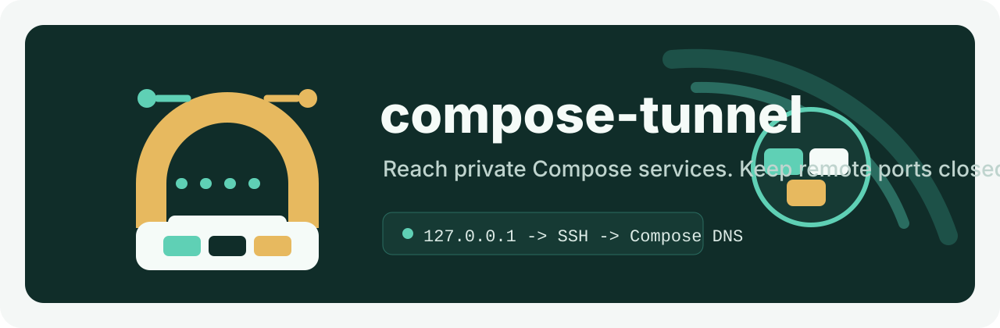

<p align="center">
  
</p>

#  compose-tunnel

`compose-tunnel` forwards internal Docker Compose services on a remote server to a local port through SSH. It discovers the running Compose containers with read-only Docker commands, selects one concrete container and its Compose network, and forwards local traffic straight to that container's IP. No remote host port is published and no relay or helper container is created.

```text
127.0.0.1:localPort
  -> SSH LocalForward
  -> selected Compose container IP:targetPort
```

## What Is Implemented

- Shared Rust core crate for config, state, SSH, Docker discovery, tunnel lifecycle, and env file blocks.
- CLI binary named `compose-tunnel`.
- Tauri 2 desktop app using the same Rust core.
- Vue 3 UI for servers, Compose discovery, tunnel start/stop, env profiles, logs, and settings.
- Env profiles in the desktop app can target a project directory, bind tunnel local ports to named variables, add extra env values, and write a managed block to that directory's `.env`.
- Env activation is scoped by target directory, so each project can have one active env while other projects keep their own active env.
- User config and state under the platform config directory via the `directories` crate.

## How It Works

Remote Docker access is read-only. The whole workflow only runs:

- `<docker> version --format ...` when `server test` checks the Docker CLI.
- `<docker> ps ...` to discover Compose projects, services, and concrete container names.
- `<docker> inspect --type container <container>` to read the container ID, Compose labels, running state, and the address on the selected network.

`compose-tunnel` never pulls, runs, execs into, stops, or removes a remote container, and it never starts a relay or helper container. Tunnels use the system `ssh` binary with `-N -L`, so SSH config, keys, agents, and `ProxyJump` keep working.

### Container selection and replicas

A `docker ps` row is one concrete container, not a deduplicated service. When a Compose service runs more than one container, the tunnel must name the exact container, either with `--container` in the CLI or with the **Service container** select in the desktop dialog, where each option shows both service and container name. Without an explicit container, a single match is selected automatically and multiple matches return an error that lists the candidates. A supplied container must belong to the requested project and service.

```bash
cargo run -p compose-tunnel-cli -- open --server staging --project myapp --service db --container myapp-db-2 --target-port 5432
```

### Network and address selection

If no network is passed, `compose-tunnel` prefers `<project>_default` and then the only attached network; anything ambiguous returns an error that lists the attached networks. The container is inspected on that network, and the forward targets its IPv4 address, falling back to IPv6 only when IPv4 is empty. IPv6 bind and target addresses are bracketed in the SSH `-L` specification.

## Run The CLI

```bash
cargo run -p compose-tunnel-cli -- init
cargo run -p compose-tunnel-cli -- server add staging --host staging.example.com --user deploy
cargo run -p compose-tunnel-cli -- server add staging-sudo --host staging.example.com --user deploy --docker-command "sudo -n docker"
cargo run -p compose-tunnel-cli -- server test staging
cargo run -p compose-tunnel-cli -- server delete staging --yes
cargo run -p compose-tunnel-cli -- compose list --server staging
cargo run -p compose-tunnel-cli -- compose services --server staging --project myapp
cargo run -p compose-tunnel-cli -- open --server staging --project myapp --service db --target-port 5432
cargo run -p compose-tunnel-cli -- open --server staging --project myapp --service db --container myapp-db-2 --target-port 5432
cargo run -p compose-tunnel-cli -- status
cargo run -p compose-tunnel-cli -- env profile list
cargo run -p compose-tunnel-cli -- env profile save staging-db --target-dir ./myapp --tunnel-port db:staging_db:DATABASE_PORT --env DATABASE_HOST=127.0.0.1
cargo run -p compose-tunnel-cli -- env profile show staging-db
cargo run -p compose-tunnel-cli -- env profile use staging-db
cargo run -p compose-tunnel-cli -- env profile write staging-db
cargo run -p compose-tunnel-cli -- env profile write staging-db --yes
cargo run -p compose-tunnel-cli -- env profile delete staging-db --yes
cargo run -p compose-tunnel-cli -- close db
cargo run -p compose-tunnel-cli -- close --all
```

`close --all` only stops local SSH forwards, so it runs immediately without a confirmation flag. `open` accepts `--container`, `--network`, `--local-port`, and `--local-host`.

## Run The Desktop App

```bash
pnpm install
pnpm tauri dev
```

## Env Profiles

The desktop Env page is list-first. Use **Add Env** to open a PrimeVue dialog, choose a target project directory, add tunnel port bindings, and add extra env values.

For a tunnel binding, the port variable name can be referenced by other env keys:

```env
staging_db=15432
DATABASE_PORT=${staging_db}
DATABASE_HOST=127.0.0.1
```

Click **Use Env** to make that profile active for its target directory. Only one env is active per target directory, but different project directories can activate different env profiles at the same time. **Write .env** writes or updates the single compose-tunnel env profile block in the selected directory's `.env`, replacing the previously written active env for that project.

The CLI can create, update, inspect, use, write, and delete the same env profiles with `compose-tunnel env profile save`, `list`, `show`, `use`, `write`, and `delete`.

The CLI and desktop app ask for confirmation before writing extra env keys that look sensitive, such as `PASSWORD`, `TOKEN`, `SECRET`, or `PRIVATE_KEY`. Use `--yes` with `compose-tunnel env profile write` for non-interactive scripts.

## Operational Notes

- **SSH forwarding policy.** The SSH daemon must allow local TCP forwarding, for example `AllowTcpForwarding local` or `AllowTcpForwarding yes`. Client-side forwards are rejected outright when it is `no`.
- **`PermitOpen` and key restrictions.** Any `PermitOpen` list, `Match` block, or forced command must permit the selected container IP and target port. `PermitOpen` matches the resolved socket address, so a list that only allows `localhost` or a specific hostname blocks these forwards.
- **Remote routing.** The SSH host network namespace must be able to route to the inspected container IP. Native Linux bridge networks satisfy this because the Docker bridge and the container addresses are local to the host.
- **Unsupported network topologies.** Rootless Docker, `macvlan`, `overlay` (Swarm), `host`, and `none` networks, and remote Docker contexts such as `DOCKER_HOST` over TLS, may not expose a routable container IP and can fail at connect time even after `docker inspect` succeeds.
- **Local bind exposure.** The default local bind address is `127.0.0.1`, and it is configurable per tunnel (`--local-host`) and in Settings. A non-loopback bind such as `0.0.0.0` exposes the private service to anyone who can reach that address, so widen it only deliberately.
- **IPv4 before IPv6.** IPv4 is preferred whenever the selected network has it; IPv6 is used only when IPv4 is empty. IPv6 targets additionally require IPv6 connectivity and a bracketed address, which `compose-tunnel` produces for you.
- **Refresh and automatic reconnect.** The Tunnels view and `compose-tunnel status` re-inspect every desired tunnel. A tunnel whose forward died or whose container IP changed is restarted on the same local host and port; a recreated container that keeps its IP only has its container ID updated. If inspection fails, the container is stopped, or the network disappears, the old forward is terminated and the tunnel is marked `error` with the reason, which the `ERROR` column of `compose-tunnel status` and the tunnel table tooltip show while it is set. Tunnels you stopped yourself stay stopped.
- **Serialized state.** Opening, closing, and refreshing tunnels share one process-wide transaction, so a status refresh that is still inspecting containers cannot overwrite a tunnel you just opened or stopped.

## Verify

```bash
cargo fmt --all -- --check
cargo test --workspace
cargo check --workspace
pnpm test
pnpm build
git diff --check
```

## Notes

The MVP uses the system `ssh` binary so existing SSH config, keys, agents, and ProxyJump rules continue to work. Remote Docker access is performed by the per-server Docker command, which defaults to `docker` and can be set to `sudo -n docker` or another custom command. It must be able to run `version`, `ps`, and `inspect` without an interactive prompt.
